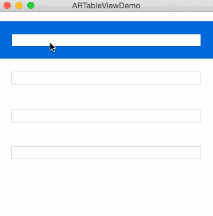

# ARTableView
NSTableView that autoresize it's cells with autolayout.
## Demo


## Usage
Set your tableView class to ARAutoresizeTableView and your tableCellView class to ARAutoresizeTableCellView, then
create a set of autolayout constraints.

In your tableViewDelegate implement the following method:

```obj-c
- (CGFloat) tableView:(NSTableView *)tableView  heightOfRow:(NSInteger)row
{
    if (row == 2) {
        return 60;
    }
    return ARAutoresizeTableViewCellHeightAuto;
}
```